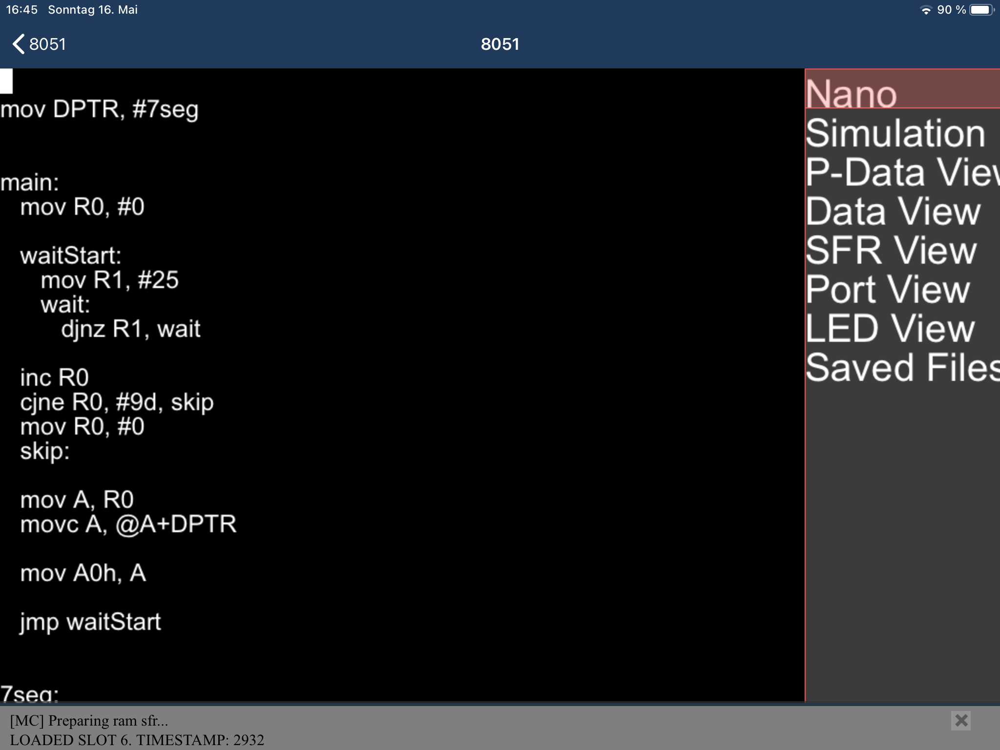
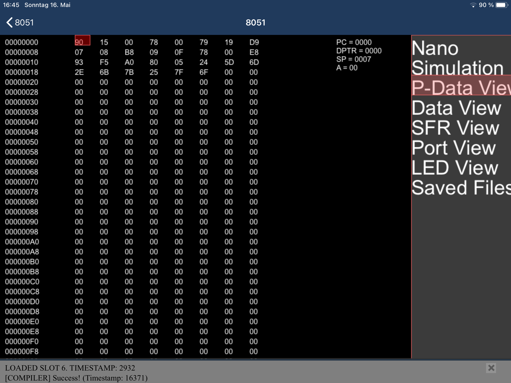
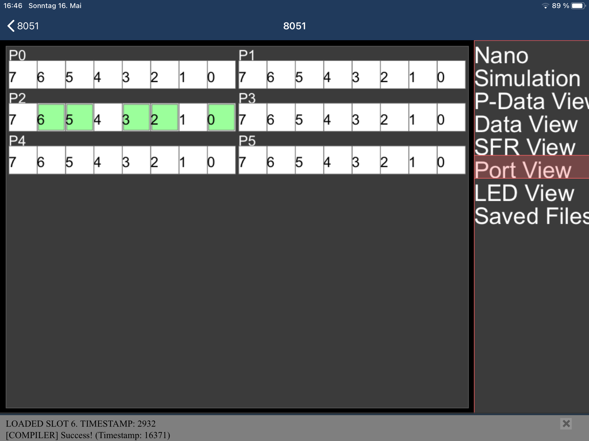

# 8051
8051 emulator. It only works with the iOS version of Processing, as it differs a bit from the PC version.

Some assembler commands are being simulated poorly (ex: I'm placing values > 255 inside single registers), or aren't even included at all (like "ANL" or "ADD").

A keyboard is necessary to use it. The text-editor doesn't react to touch-inputs.

**What's working:**
* Text editor
* Compiler (turns written assembler code into program code)
* Simulator (runs program code)
* Save & Load files
* A couple of UI things
* ???

**Screenshots:**

